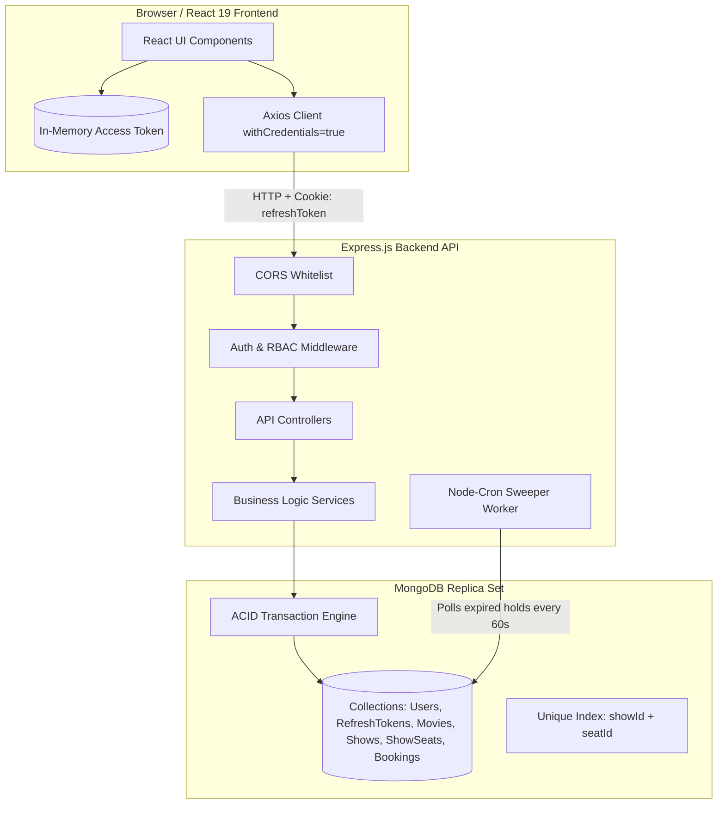
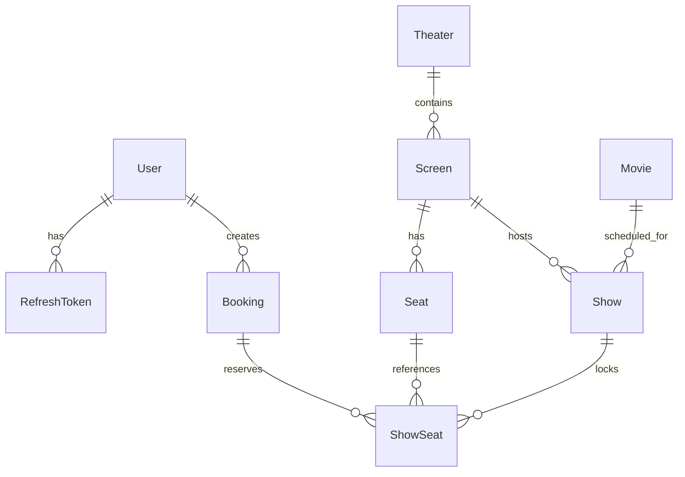

# 🎬 Movie Reservation & High-Concurrency Ticketing Engine

A full-stack movie reservation platform built with Node.js, Express, MongoDB, and React. It solves the classic ticket-booking concurrency challenge: **guaranteeing zero double-bookings under burst traffic**, enforcing temporary seat holds, and providing an enterprise-grade dual-token authentication flow.

---

## 📌 Project Overview

### What the Application Does
The platform lets moviegoers browse currently showing films, locate cinema theaters, inspect real-time seat availability across tiered seating layouts (Regular, Premium, VIP), hold seats with a 5-minute reservation timer, and finalize bookings. It also includes an AI-assisted seat recommendation tool powered by Google Gemini and a self-service cancellation dashboard.

### The Problem It Solves
In standard CRUD ticketing applications, two users clicking "Book" on the exact same seat at the same millisecond causes a **race condition** leading to double-booked seats and angry customers. 

This project solves this at the database level:
1. **Zero Double-Bookings:** Enforces atomic reservation locks using MongoDB multi-document transactions coupled with a compound unique index constraint `{ showId: 1, seatId: 1 }` on the `ShowSeat` collection.
2. **Orphaned Lock Prevention:** Implements a 5-minute temporary seat hold pattern backed by an automated background worker that sweeps expired pending bookings and releases seats back into the pool.
3. **Enterprise Security:** Replaces insecure `localStorage` JWT storage with short-lived in-memory access tokens, HTTP-Only refresh cookies with single-use rotation, and SHA-256 token hashing at rest.

---

## ⚡ Key Features

- **User Authentication & RBAC:** Secure sign-up/login with bcrypt password hashing and Role-Based Access Control (`user` and `admin`).
- **Movie Catalog & Live Search:** Browse active movies with title-based search (`GET /api/movies/search?title=...`).
- **Cinema Venues & Screens:** Browse partner multiplexes, inspect theater locations, and review auditoriums.
- **Auditorium Matrix with Tiered Seating:** Color-coded seating grid (Regular = Green, Premium = Purple, VIP = Gold, Selected = Blue, Booked = Gray).
- **Atomic 5-Minute Seat Hold:** Select seats and hold them for exactly 5 minutes with a live countdown timer during checkout.
- **Double-Booking Protection:** Multi-client stress tested under 500 concurrent requests with a **0% double-booking rate**.
- **Payment & Checkout State Machine:** Simulates payment processing and transitions bookings atomically from `pending` to `confirmed`.
- **Booking Management & 2-Hour Cancellation Rule:** Users can view their booking history in "My Bookings" and cancel tickets only if the showtime is at least 2 hours away.
- **Gemini AI Seat Recommender:** Suggests the best available seats based on user group size (solo, couple, group) and viewing style (front, center, back).
- **Admin Back-Office Portal:** Role-guarded dashboard (`/admin`) to ingest movies, archive titles (soft-delete), schedule showtimes with collision avoidance, and manage venues.

---

## 🛠️ Tech Stack

### Frontend
- **React 19** (Vite build tool)
- **React Router v7** (Client-side routing & route guards)
- **Lucide React** (Clean icons)
- **Axios** (Configured with `withCredentials: true` and 401 silent refresh retry interceptors)
- **Vanilla CSS** (Component-scoped, modular stylesheets without utility bloat)

### Backend
- **Node.js** (v20+)
- **Express.js** (v5)
- **MongoDB & Mongoose** (Replica-set enabled for multi-document ACID transactions)

### Authentication & Security
- **JSON Web Tokens (jsonwebtoken)**
- **HTTP-Only, SameSite=Strict Cookies** via `cookie-parser`
- **Crypto Module (Node native):** SHA-256 hashing of refresh tokens at rest & UUID `jti` nonces
- **Bcrypt.js** (Salted password hashing with 11 rounds)
- **CORS** (Restricted origin whitelisting with credentials support)

### Background Workers & AI
- **Node-Cron** (Scheduled background sweeper for expired seat holds)
- **Google Generative AI SDK** (`@google/genai` with Gemini 2.5 Flash)

---

## 🏗️ System Architecture



### Communication Flow
1. **API Requests:** The React client communicates with the Express backend over HTTP using a central Axios instance configured with `withCredentials: true`.
2. **Token Transmission:** Short-lived 15-minute access tokens are injected into the `Authorization: Bearer <token>` header from React memory. The 7-day refresh token travels automatically inside an `httpOnly`, `SameSite=Strict` cookie restricted to `/api/auth`.
3. **Database Layer:** The backend communicates with MongoDB via Mongoose. Write operations involving seat reservation, locking, and confirmation execute inside MongoDB transactions with snapshot isolation.
4. **Sweeper Reconciliation:** A scheduled `node-cron` job runs every 60 seconds independently to identify expired holds and release locks back into the available pool.

---

## 📂 Project Structure

```
MovieReservationSys/
├── backend/
│   ├── scripts/                  # Stress tests, seeders, and verification suites
│   │   ├── test-concurrency.js   # 500-request burst seat-lock concurrency test
│   │   ├── test-secure-auth.js   # 7-step token rotation & replay attack test
│   │   ├── test-admin-flow.js    # RBAC 403 enforcement & admin flow test
│   │   ├── create-admin.js       # Admin user provisioner
│   │   └── refresh-shows.js      # Showtime rollover tool
│   ├── src/
│   │   ├── config/               # Database connection setup
│   │   ├── controllers/          # Express route controllers
│   │   ├── middleware/           # authMiddleware, adminMiddleware, errorHandler
│   │   ├── models/               # Mongoose schemas (User, RefreshToken, Booking, ShowSeat...)
│   │   ├── routes/               # Express routers (/auth, /movies, /shows, /bookings...)
│   │   ├── services/             # Core business logic & database queries
│   │   ├── utils/                # transactionHelper, generateToken, automation (cron)
│   │   ├── validators/           # Joi validation schemas
│   │   └── app.js                # Express app entry & server listen
│   └── .env                      # Backend environment variables
│
├── frontend/
│   ├── src/
│   │   ├── api/                  # Axios client configuration & interceptors (client.js)
│   │   ├── components/           # Reusable UI (Navbar, SeatHoldTimer, GeminiRecommender...)
│   │   ├── context/              # AuthContext (in-memory token, silent session rehydration)
│   │   ├── pages/                # Route views (MoviesPage, SeatSelectionPage, CheckoutPage, AdminPage...)
│   │   ├── App.jsx               # Route definitions & layout shell
│   │   ├── main.jsx              # React DOM bootstrap
│   │   └── index.css             # Base CSS tokens
│   └── package.json
└── README.md
```

---

## 🔒 Authentication & Security Architecture

I redesigned the authentication system from a prototype storing JWTs in `localStorage` into an **OWASP-aligned dual-token system**:

| Attack Vector / Metric | Old Setup (`localStorage`) | Our Upgraded Architecture |
| :--- | :--- | :--- |
| **XSS Token Exfiltration** | **Vulnerable:** Any injected script can call `localStorage.getItem("token")`. | **Immune:** Refresh token is in an `httpOnly` cookie; JavaScript cannot read it. |
| **Token Blast Radius** | **7 Days:** A stolen token granted unrestricted access for a week. | **15 Minutes:** Access tokens live 15 mins in memory only. |
| **Database Leaks / Insider Threats** | **Vulnerable:** Plaintext tokens stored in DB let attackers forge sessions. | **Immune (SHA-256 at Rest):** Database stores only 64-char SHA-256 hashes (`tokenHash`). |
| **Replay Attacks** | **None:** Stolen refresh tokens could be reused indefinitely. | **Single-Use Rotation:** Using a refresh token invalidates it and issues a fresh pair. |
| **True Server-Side Logout** | **Fake:** Deleting client storage left token valid on the server. | **True Revocation:** `/api/auth/logout` deletes the token hash from MongoDB. |

### How Silent Refresh Works in Frontend
1. The 15-minute `accessToken` lives strictly in React memory (`useState` / JS closure).
2. When the user reloads the page or reopens the tab, `AuthContext` runs a silent call to `POST /api/auth/refresh`. The browser sends the HTTP-Only cookie, and the server returns a fresh access token without user friction.
3. If an access token expires while interacting with the app, the Axios response interceptor in [`frontend/src/api/client.js`](file:///d:/Projects/fullStack_MERN/Project/MovieReservationSys/frontend/src/api/client.js) catches the `401`, triggers a single shared `refreshPromise` (deduplicating parallel requests), updates the in-memory token, and transparently retries the original request.

---

## 🎟️ Booking System & Concurrency Controls

### 1. Double-Booking Prevention
Preventing two customers from booking the same seat simultaneously relies on two defensive layers:
- **Application Level:** A MongoDB multi-document transaction (`withTransaction`) queries `ShowSeat` for existing locks.
- **Database Level Constraint:** A compound unique index in [`ShowSeat.js`](file:///d:/Projects/fullStack_MERN/Project/MovieReservationSys/backend/src/models/ShowSeat.js):
  ```javascript
  showSeatSchema.index({ showId: 1, seatId: 1 }, { unique: true });
  ```
  If 500 clients simultaneously attempt to reserve seat `B4`, exactly 1 insert succeeds. The other 499 requests hit a MongoDB `E11000 duplicate key error` and are caught, returning an immediate `409 Conflict: Some seats are already reserved or booked`.

### 2. 5-Minute Seat Hold Pattern & Automated Cleanup
- When a user initiates checkout, a `Booking` record is created with `status: "pending"` and `expiresAt: now + 5 minutes`.
- Corresponding `ShowSeat` records are locked with `status: "locked"`.
- **Why not use MongoDB Native TTL Index here?**
  Native TTL deletes documents physically without cascading. Deleting the booking would erase customer audit records and leave **orphaned locks** in `ShowSeat` forever.
- **The Solution:** A scheduled background sweeper in [`automation.js`](file:///d:/Projects/fullStack_MERN/Project/MovieReservationSys/backend/src/utils/automation.js) polls indexed `expiresAt` timestamps every 60 seconds. When an expired hold is found, it transitions the booking status to `"expired"` and deletes the temporary locks in `ShowSeat`, restoring seat availability.

### 3. Cancellation Policy ($\ge 2$ Hours Rule)
- Customers can cancel confirmed bookings from the "My Bookings" page.
- The service inspects `show.startTime`:
  ```javascript
  const TWO_HOURS = 2 * 60 * 60 * 1000;
  if (new Date(show.startTime).getTime() - Date.now() < TWO_HOURS) {
    throw new AppError("Bookings cannot be cancelled within 2 hours of showtime", 400);
  }
  ```
- If eligible, the booking is marked `"cancelled"` and the seats in `ShowSeat` are deleted in a single transaction.

---

## 🗄️ Database Design



### Models & Responsibilities
- **`User`**: Accounts with `name`, `email`, hashed `password`, and `role` (`user`, `admin`).
- **`RefreshToken`**: Session records with `userId`, `tokenHash` (SHA-256), and `expiresAt` (native MongoDB TTL index for automatic expiration purge).
- **`Movie`**: Metadata including `title`, `duration`, `genre`, `language`, `posterUrl`, and `status` (`active`, `archived`).
- **`Theater`**: Venue data including `name`, `city`, `address`, and `screensCount`.
- **`Screen`**: Auditorium entity with `theaterId`, `name`, `totalSeats`, and `layoutType` (`standard`, `imax`, `4dx`).
- **`Seat`**: Physical seat units with `screenId`, `row` (A, B, C...), `number` (1..10), and `type` (`regular`, `premium`, `vip`).
- **`Show`**: Movie scheduled on a screen at a specific `startTime` with `endTime` and `basePrice`. Includes collision detection against overlapping shows on the same screen.
- **`ShowSeat`**: Live reservation locks with compound unique index `{ showId: 1, seatId: 1 }`, referencing `bookingId` and `status` (`locked`, `booked`).
- **`Booking`**: Customer order tracking `userId`, `showId`, `seatIds`, `totalAmount`, `status` (`pending`, `confirmed`, `cancelled`, `expired`), and hold `expiresAt`.

---

## 📡 API Documentation

### Authentication (`/api/auth`)
| Method | Endpoint | Access | Description |
| :--- | :--- | :--- | :--- |
| `POST` | `/api/auth/register` | Public | Register new user; returns access token + sets HTTP-Only refresh cookie |
| `POST` | `/api/auth/login` | Public | Authenticate user; returns access token + sets HTTP-Only refresh cookie |
| `POST` | `/api/auth/refresh` | Public (Cookie) | Rotates refresh token and returns fresh 15-minute access token |
| `POST` | `/api/auth/logout` | Public (Cookie) | Deletes token hash from MongoDB and clears browser cookie |

### Movies (`/api/movies`)
| Method | Endpoint | Access | Description |
| :--- | :--- | :--- | :--- |
| `GET` | `/api/movies` | Public | Get all active movies |
| `GET` | `/api/movies/search?title=...` | Public | Search movies by title regex |
| `GET` | `/api/movies/:id` | Public | Get movie details |
| `POST` | `/api/movies` | Admin | Ingest new movie into catalog |
| `PATCH` | `/api/movies/:id/archive` | Admin | Soft-delete/archive a movie |

### Shows & AI Recommendations (`/api/shows`)
| Method | Endpoint | Access | Description |
| :--- | :--- | :--- | :--- |
| `GET` | `/api/shows/movie/:movieId` | Public | Get scheduled showtimes for a movie |
| `GET` | `/api/shows/:id` | Public | Get show details, screen, and base pricing |
| `GET` | `/api/shows/:showId/recommend-seats` | Public | Google Gemini AI seat recommendations |
| `POST` | `/api/shows` | Admin | Schedule showtime with overlap collision prevention |

### Bookings (`/api/bookings`)
| Method | Endpoint | Access | Description |
| :--- | :--- | :--- | :--- |
| `GET` | `/api/bookings/show/:showId/availability` | Public | Returns complete auditorium matrix with seat tiers and lock states |
| `POST` | `/api/bookings` | User | Creates atomic 5-minute seat hold lock in MongoDB |
| `GET` | `/api/bookings/:bookingId` | User | Get booking status and hold countdown timer |
| `PATCH` | `/api/bookings/:bookingId/confirm` | User | Confirm payment and finalize seat booking |
| `PATCH` | `/api/bookings/:bookingId/cancel` | User | Cancel booking (enforcing $\ge 2$ hours rule) |
| `GET` | `/api/bookings/me` | User | Get current user's past and active booking history |

### Theaters & Screens (`/api/theaters`, `/api/screens`)
| Method | Endpoint | Access | Description |
| :--- | :--- | :--- | :--- |
| `GET` | `/api/theaters` | Public | List partner cinema venues |
| `GET` | `/api/theaters/:id` | Public | Get cinema theater details |
| `POST` | `/api/theaters` | Admin | Register new theater venue |
| `GET` | `/api/screens` | Public | List screens with venue details |
| `POST` | `/api/screens` | Admin | Create screen & auto-generate physical seats in a transaction |

---

## 📸 Screenshots & UI Flow

| View | Description |
| :--- | :--- |
| **Catalog & Search (`/`)** | 4-column responsive grid displaying active movies with live title search and theater links. |
| **Showtimes (`/movies/:id`)** | Movie details, synopsis, duration, and scheduled showtimes grouped with venue info. |
| **Seat Matrix (`/shows/:id/seats`)** | Interactive auditorium grid with color-coded tiers (Regular, Premium, VIP) and Gemini AI selector. |
| **Checkout & Hold Timer (`/checkout/:id`)** | 5-minute live circular countdown timer, ticket summary breakdown, and payment confirmation. |
| **My Bookings (`/my-bookings`)** | User dashboard tracking active and past bookings with 2-hour cancellation validation. |
| **Admin Portal (`/admin`)** | Protected dashboard for movie ingestion, soft-delete archiving, and showtime scheduling. |

---

## 💻 Installation & Setup

### Prerequisites
- **Node.js** (v18 or higher)
- **MongoDB** (Local instance or MongoDB Atlas replica set for transactions)
- **Git**

### 1. Clone Repository
```bash
git clone https://github.com/PranitBijave27/movie-reservation-system.git
cd movie-reservation-system
```

### 2. Setup Backend
```bash
cd backend
npm install

# Create environment file
cp .env.example .env # or configure manually as shown below
```

Configure your `backend/.env`:
```env
PORT=3000
NODE_ENV=development
MONGO_URI=mongodb://127.0.0.1:27017/movieDB
JWT_SECRET=your_super_secret_jwt_access_key
JWT_REFRESH_SECRET=your_super_secret_jwt_refresh_key
CLIENT_URL=http://localhost:5173
GEMINI_API_KEY=your_gemini_api_key_optional
```

Start the backend:
```bash
npm run dev
# Server running on http://localhost:3000
```

### 3. Setup Frontend
In a new terminal:
```bash
cd ../frontend
npm install
npm run dev
# Vite dev server running on http://localhost:5173
```

### 4. Seed Admin Account & Refresh Shows
To seed sample data and create an administrator account:
```bash
cd ../backend

# Create admin user (admin@example.com / admin123)
node scripts/create-admin.js

# Roll showtimes forward to upcoming dates if needed
node scripts/refresh-shows.js
```

---

## 🔑 Environment Variables Guide

| Variable | Description | Example / Default |
| :--- | :--- | :--- |
| `PORT` | Port for Express server | `3000` |
| `NODE_ENV` | Environment mode (`development` / `production`) | `development` |
| `MONGO_URI` | MongoDB connection URI (Replica Set required for transactions) | `mongodb://127.0.0.1:27017/movieDB` |
| `JWT_SECRET` | Secret key used to sign 15-minute access tokens | Long random string |
| `JWT_REFRESH_SECRET` | Secret key used to sign 7-day refresh tokens | Long random string |
| `CLIENT_URL` | Frontend origin for CORS whitelist and cookie transmission | `http://localhost:5173` |
| `GEMINI_API_KEY` | Google Gemini API key for AI seat recommendations | Optional (Mock fallback included) |
| `VITE_API_URL` | Frontend API base URL | `http://localhost:3000/api` |

---

## 🚶 How to Use (User Walkthrough)

1. **Register / Login:** Create an account or sign in. Standard users are routed to `/`; logging in with `admin@example.com` automatically routes to `/admin`.
2. **Find a Movie:** Use the search bar on the homepage to find a film and click **Select Showtime**.
3. **Select Seats:** Pick a showtime to load the interactive seating grid. Select individual seats or click **Ask Gemini AI** to auto-select optimal seats based on your preferences.
4. **Hold & Checkout:** Click **Hold Seats & Proceed**. The system locks your seats for 5 minutes and displays the live countdown timer.
5. **Confirm Booking:** Click **Pay & Confirm Booking**. The booking transitions to confirmed and the seats are permanently marked booked.
6. **Manage & Cancel:** Go to **My Bookings** in the navbar to review your tickets or cancel them (if showtime is $\ge 2$ hours away).

---

## 🚀 Future Engineering Improvements

- [ ] **Real Payment Gateway Integration:** Replace simulated payment with Stripe Webhooks or Razorpay order verification with idempotency keys.
- [ ] **Distributed Redis Locking (Redlock):** Offload seat holds from MongoDB write locks to memory-first Redis distributed locks for 10,000+ req/s throughput.
- [ ] **QR Code Ticket Delivery:** Generate dynamic, signed QR code passes for gate entry validation.
- [ ] **WebSocket Real-Time Seat Updates:** Use Socket.io or WebSockets to reflect seat hold/release state live across other viewers' screens without polling.
- [ ] **3-Tier Tenant Scoping:** Introduce `theater_operator` role scoped strictly to their assigned cinema venue.

---

## 👨‍💻 Author

**Pranit Bijave**  
*Information Technology Student*  
*Shri Sant Gajanan Maharaj College of Engineering (SSGMCE), Shegaon*

- **GitHub:** [@PranitBijave27](https://github.com/PranitBijave27)
- **Repository:** [High-Concurrency-Ticket-Reservation-Engine](https://github.com/PranitBijave27/High-Concurrency-Ticket-Reservation-Engine)

